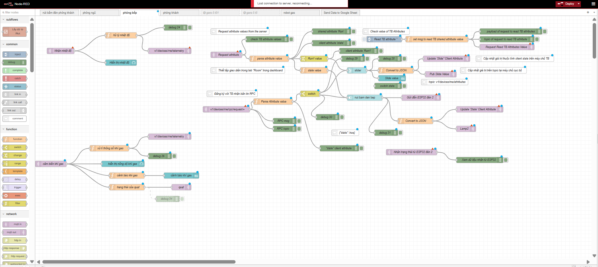

## 🔧 Phần cứng sử dụng

### 📡 Vi điều khiển
- ESP32 DevKit

### 🌡️ Cảm biến
- DHT11 (nhiệt độ, độ ẩm)
- MQ135 (khí gas)
- BH1750 (ánh sáng)
- PIR SR505 (chuyển động)
- RFID RC522

### ⚙️ Thiết bị chấp hành
- Relay 5V
- Servo SG90 (điều khiển rèm)
- Buzzer
- Step Motor + A4988

---

## 💻 Công nghệ sử dụng
- Node-RED (Flow-based programming)
- MQTT (Pub/Sub communication)
- Node.js
- ThingsBoard (IoT platform)

---

## 🔄 Nguyên lý hoạt động
1. Cảm biến thu thập dữ liệu môi trường  
2. ESP32 gửi dữ liệu qua MQTT  
3. Node-RED xử lý dữ liệu  
4. Hiển thị lên Dashboard  
5. Người dùng điều khiển thiết bị  
6. Lệnh gửi lại ESP32  

---

## 📊 Chức năng chính
- 🌡️ Giám sát nhiệt độ, độ ẩm  
- 💡 Điều khiển đèn  
- 🪟 Điều khiển rèm cửa  
- ⚠️ Cảnh báo khí gas  
- 👀 Phát hiện chuyển động  
- 📈 Hiển thị dữ liệu realtime  

---

## 📷 Hình ảnh hệ thống

### 🔧 Phần cứng

### 📊 Dashboard

